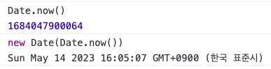

## 3.useCountDown

[👉 useArrayState](../../../packages/lib/src/hooks/useCountdown.ts)  
[👉 Day3](../src/components/Day3.tsx)

```ts
function useCountdown(endTime: Date, options: CountdownOptions = {}): number {
  const { interval = 1_000, onDown, onEnd } = options
  // 현재 시간을 state에 저장
  const [time, setTime] = useState<Date>(() => new Date())
  // 남은 시간 계산 (종료시간 - 현재시간)
  const restTime = endTime.getTime() - time.getTime()
  // interval과 restTime을 사용하여 콜백 함수가 호출될 횟수 `count` 계산
  const count = restTime > 0 ? Math.ceil(restTime / interval) : 0

  const onTick = () => {
    const newTime = new Date()
    // 현재 시간이 종료시간 보다 크면 타이머가 종료된 상황
    if (newTime > endTime) {
      // CountdownOptions의 onEnd 콜백 함수가 있으면 호출,
      if (onEnd) {
        onEnd(newTime)
      }
      // setTime을 사용해 상태 값을 종료시간으로 설정하고 함수 종료
      setTime(endTime)
      return
    }

    // 현재 시간이 종료시간보다 작다면 타이머가 동작중
    // CountdownOptions의 onDown 콜백함수가 있으면 호출
    // setTime을 사용해 상태 값을 현재시간으로 업데이트
    if (onDown) {
      onDown(restTime, newTime)
    }

    setTime(newTime)
  }
  useIntervalWhen(onTick, count ? interval : undefined, true, true)

  return count
}
```

```ts
// 현재 시각으로부터 10초뒤!
const endTime = new Date(Date.now() + 10000)
```



`Date.now()`는 현재 시각을 밀리초 단위로 나타낸다
