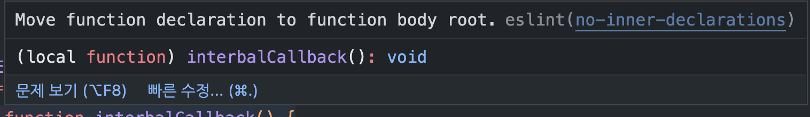

## 2.useIntervalWhen

[👉 useIntervalWhen](../../../packages/lib/src/hooks/useIntervalWhen.ts)  
[👉 Day2](../src/components/DayTwo.tsx)

```ts
/**
 * callback, 카운트시간, 시작여부, 즉시 시작 여부
 * callback 함수를 주어진 intervalDurationMs 간격으로 호출합니다. 이때 when 조건이 true일 때만 작동합니다. startImmediate 옵션이 true로 설정되어 있다면,
 * callback 함수가 intervalDurationMs 간격으로 호출되기 전에 먼저 한번 호출
 * */
function useIntervalWhen(callback: () => void, intervalDurationMs = 0, when = true, startImmediate = false): void {
  // useRef에 `callback` 함수를 저장하고, useEffect를 사용해 이전 `callback`과 현재 `callback`이 다르면 업데이트

  const savedRefCallback = useRef<() => void>()

  useEffect(() => {
    savedRefCallback.current = callback
  })

  useEffect(() => {
    if (when) {
      const intervalCallback = () => {
        savedRefCallback.current?.()
      }

      // startImmediate가 true면
      // `callback`이 `intervalDurationMs` 간격으로 호출되기 전에 먼저 한번 호출
      if (startImmediate) {
        intervalCallback()
      }

      const interval = window.setInterval(intervalCallback, intervalDurationMs)

      return () => {
        window.clearInterval(interval)
      }
    }
    // when이 false일 때는 빈 함수(noop)를 반환
    // const noop = () => {}
    return noop
  }, [when, intervalDurationMs, startImmediate])
}
```

- 작성 중 lint에 의한 error `no-inner-declarations`

> no-inner-declarations는 ESLint의 규칙 중 하나로, 중첩된 블록 내에서 함수나 변수를 선언하는 것을 금지하는 규칙입니다.

> 이 규칙을 적용하면, 함수나 변수를 중첩된 블록 내에서 선언하는 것을 방지하여 코드의 가독성과 유지보수성을 높일 수 있습니다. 또한, 이 규칙은 호이스팅(hoisting) 문제를 방지할 수 있습니다. 호이스팅은 변수나 함수 선언이 스코프의 맨 위로 올라가는 것을 의미합니다. 때문에 중첩된 블록 내에서 함수나 변수를 선언하면, 예상치 못한 동작을 일으킬 수 있습니다.



```ts
if (when) {
  // ❌
  function intervalCallback() {
    savedRefCallback.current?.()
  }
}

if (when) {
  // ✅
  const intervalCallback = () => {
    savedRefCallback.current?.()
  }
}
```

```ts
// Good ✅
function foo() {}

// Bad ❌
if (test) {
  function foo() {}
}

function anotherThing() {
  var fn

  if (test) {
    // Good ✅
    fn = function expression() {}

    // Bad ❌
    function declaration() {}
  }
}
```
